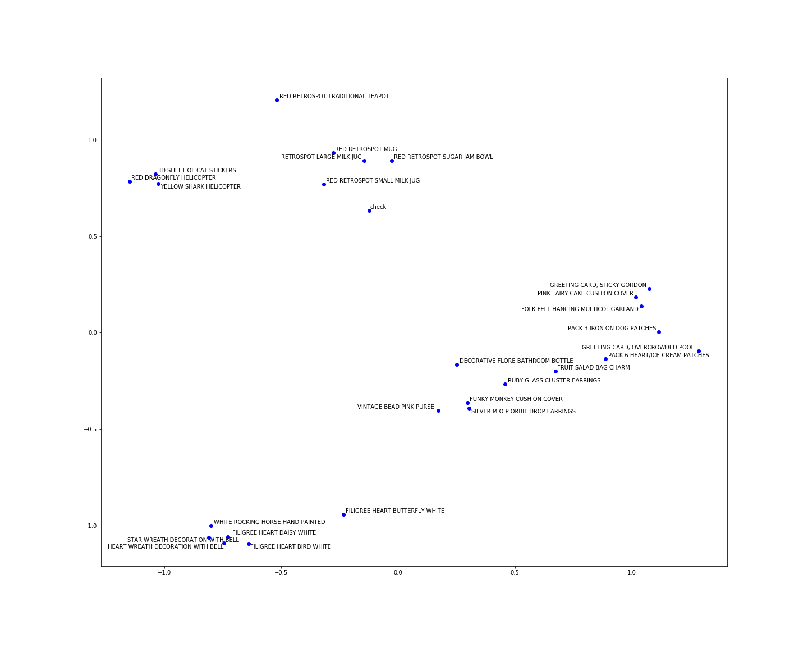

Transactions2Vec
==============================

**Learn embeddings** from e-commerce online transactions by applying **Word2Vec's Skip-Gram with negative sampling** architecture.

The project consists in a series of Jupyter notebooks and python scripts strucured in the following way:
1. `src/data/initial_exploration.ipynb`: contains some raw data exploration analysis
2. `src/data/make_dataset.py`: cleans the raw data and prepares it for training; the final dataset is exported to `data/processed/data.csv`
3. `src/model_creation.ipynb`: contains the model training and evaluation steps
4. `src/prediction.ipynb`: uses the trained model to make predictions; A series of random resulted embeddings have been plotted in 2D space in order to highlight possible clusters formed around similar shopping bag items.

## Install
Run `pip install -r requirements.txt` to install dependencies.

